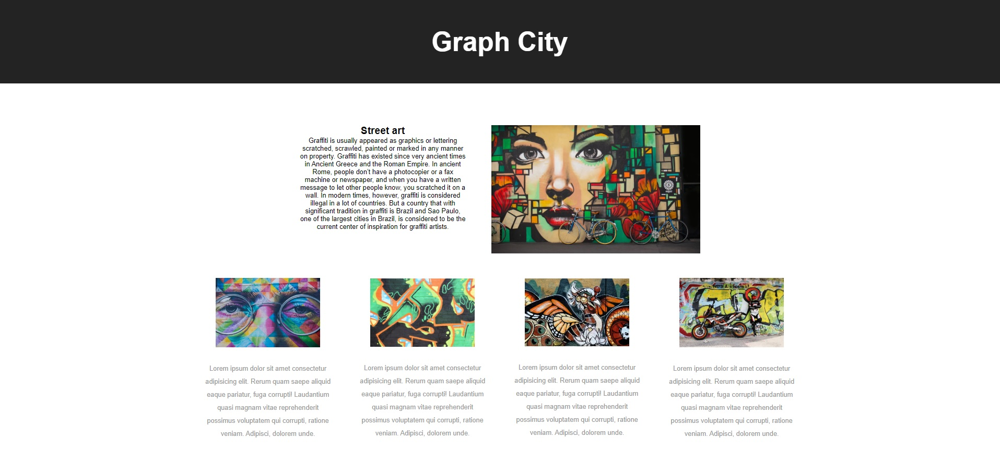

# Positioning with Flexbox and Grid

- Repository: `Flexbox-grid-positioning`

- Type of Challenge: `Learning`

- Duration: `2 days`

- Group: `yes | 2 persons`

- Deployment strategy : repository on GitHub

## Learning Objectives

You now know the specific functions of html and css. One is for structuring the content, the other one styles it. What you see on your screen is the result of both. 

But CSS can do more than just coloring or resizing of elements. Thanks to [CSS flexbox](https://developer.mozilla.org/en-US/docs/Web/CSS/CSS_Flexible_Box_Layout/Basic_Concepts_of_Flexbox) or more recently [CSS grid](https://developer.mozilla.org/en-US/docs/Web/CSS/CSS_Grid_Layout) you can also change the layout of your page. 

The goal of this challenge is to learn how to position elements with flexbox and/or grid.

Try to recreate the following example. 

The [HTML](./assets/index.html) file for this exercise is provided but without any classes or ids. Try your best to find out what elements need styling and what classnames you will use. Take your time to look at the structure of the html before you write any css. 

Your objectives are:

- Being able to position elements with flexbox and/or grid
- Using the correct terms to explain how you structured your grid or flexbox 

## Some resources

Grid:

- [CSS tricks guide](https://css-tricks.com/snippets/css/complete-guide-grid/)
- [MDN docs](https://developer.mozilla.org/en-US/docs/Web/CSS/CSS_Grid_Layout)
- [Grid game](http://cssgridgarden.com/)

- [this website](http://www.google.com)

Flexbox:

- [CSS tricks guide](https://css-tricks.com/snippets/css/a-guide-to-flexbox/)
- [MDN docs](https://developer.mozilla.org/en-US/docs/Web/CSS/CSS_Flexible_Box_Layout/Basic_Concepts_of_Flexbox)
- [Flexbox game](https://flexboxfroggy.com/)

- [this website](http://www.google.com)

## Deliverables
1. Publish your source code on the GitHub repository.

### Steps
1. Create and clone your repository
2. Add the index.html file and a CSS folder
3. Agree with your partner on who will use flexbox and who will use grid
4. Create a grid.css or flex.css
5. Recreate the layout from the example image

When finished:

1. Explain how you made your layout to your partner
2. Use the correct terms to explain what you did
3. Now try to use the other technology to achieve the same result

### Groups

  - Jennis Seeuws &  Shadia Nasman    
  - Kasra Tabrizi &  Daniel De Bondt    
  - Tibo Colman &  Welid Labidi    
  - Danny Eeraerts &  Aline Lanckneus    
  - Nathalie Pillen &  Claas Steigueber    
  - Thi My Le TRUONG &  Adel El Allaoui    
  - David Bogaert &  Cathérine De Meulemeester    
  - Crisse SOTO &  Stijn Peeters    
  - Lisa Cantaert &  Naoyuki Arakawa    
  - Kristel Van Mileghem &  Geert Uyttendaele    
  - Sander Dooms &  Erin-Louise Joosen    
  - Jan De Clercq &  Jeroen De Vetter    
  - Moumita Basak &  Tabitha Bidee    
  - Reinaert Depourcq &  Jasper Springael    
  - Steven Nuyttens & Abdel Lahlali

 
