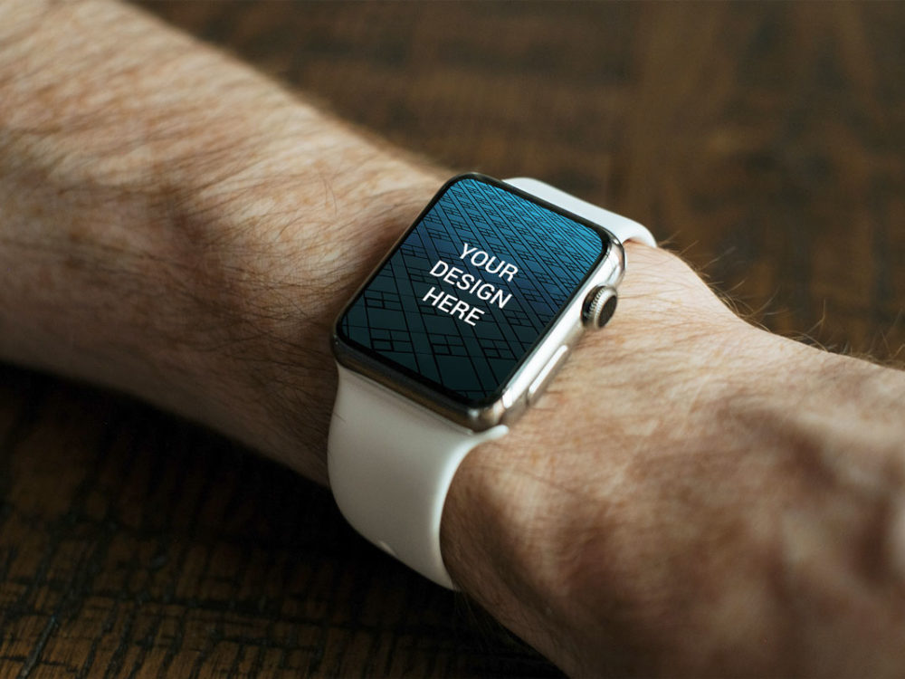
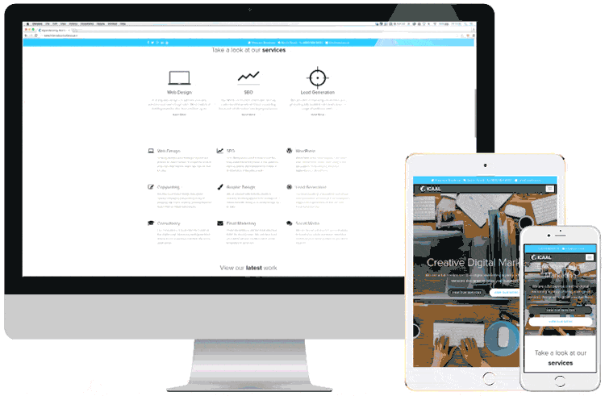
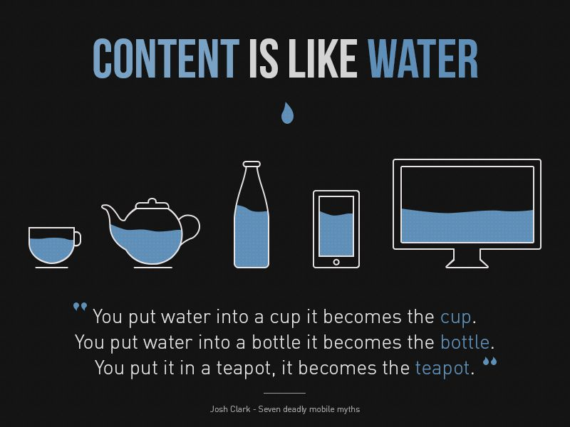

# Responsive Web Design

- Repository: `responsive-web-design`  
 
- Type of Challenge: `Learning`  
  
- Duration: `1 day`  
  
- Deployment strategy : repository on GitHub

## The Problem

**Multiplicity of Screens**  
Today, the same content can be seen on different sized devices; HD TV, a laptop, a watch, a smartphone. You can imagine the content should adapt for each device. So how? A code-base for each platform? Duplicating the code for each version of the same website? 

The problem came to be in 2007 with the surge of the first iPhones, since then it's been a rush of new sizes. The industry needed time to adapt and find a new standard. In 2010, the web designer [Ethan Marcotte](https://twitter.com/beep) introduced the term "Responsive Web Design" or (RWD) for this on [A List Apart](http://alistapart.com/article/responsive-web-design).

## The solution : CSS Media Queries
With Media Queries, we can tell the client : if the size of the screen is X, use these css properties, otherwise those.
The expected UX result is something like this :

Responsive web design has led to a new way of looking at a site, increasingly differentiating between substance (content) and appearance (the container: the device).

## Your turn
1. Read the [documentation](https://developer.mozilla.org/en-US/docs/Web/CSS/@media) or look for tutorials online.
2. Create the repository and clone it to your device.
3. Add an index.html file and a css folder with the style.css file.
3. Perform these few exercises to take try out media queries.

### 1. Change the colour
Make it so the background color of body is **red** when the width of the viewport is smaller than 300px, **green** when the viewport width is bigger than 300px and smaller than 768px, and **blue** when the viewport is bigger than 768px.

### 2. Display / hide elements
Add three `div` elements to your html: one div with the id="small", one div with the id="medium", another div with the id="large". In each element add the word small, medium and large respectively as content for display purposes.

Make it so only one div is displayed, according to the width of the current viewport.

### 3. Adjust the layout
Use flexbox or grid to achieve the following results:
- if small, the 3 divs are stacked on top of one and other.
- if medium, the first div takes 2/3 of width, the second 1/3 of width and the third the full width.
- if big, the 3 divs should be next to one another.

### 4. Continue
Make sure every next assignment is responsive!
Some frameworks do this for you, check it out in bootstrap (amongst others) in the future :)

