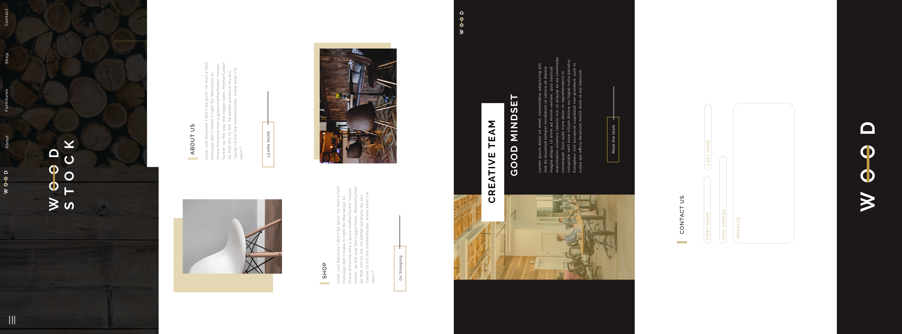

# Business Group Project

- Repository: `name-of-your-business`
- Type of Challenge: `Consolidation`
- Duration: `4 days`
- Deadline: `29/10/19 16:00`
- Deployment strategy :
	- Github page
- Team challenge : `yes (max 4)`
	- frontend: 4
	- project management : 1

## Group exercise

  - Jan De Clercq & Tibo Colman & Jeroen De Vetter & Shadia Nasman    
  - Claas Steigueber & Welid Labidi & Jennis Seeuws & Aline Lanckneus    
  - Kristel Van Mileghem & Lisa Cantaert & Danny Eeraerts & Tabitha Bidee 
  - Naoyuki Arakawa & Cathérine De Meulemeester & David Bogaert & Reinaert Depourcq
  - Crisse Soto & Sander Dooms & Nathalie Pillen & Stijn Peeters    
  - Jasper Springael & Daniel De Bondt & Geert Uyttendaele & Erin-Louise Joosen    
  - Moumita Basak & Kasra Tabrizi & Thi My Le Truong & Steven Nuyttens

## Objectives

To conclude our month of HTML and CSS you will create a **finished website** for a real or fictional company or organisation, **in group**. 

You are free to choose what type of company or organisation, but keep it professional. You could, for example, refresh the outdated website of a **charity** or **local youth movement**. Or you can just create **your own company**, complete with logo and products. You can look for inspiration [online](https://onepagelove.com).

Don't have any inspiration and just want to focus on your code? Our resident web designer Kevin has prepared a design for you to use: *(you can ask him for his design files)* 

---

---

##### Some tips:

- Don't just open your editor and start coding! Do some research first!

- Building a website requires some planning. Think about all the different functionalities your website will need. 

- Think about the design, create a prototype on paper.

- Read the requirements before you start

- Write semantic HTML and keep your CSS functional 

- Did you finish your part of the project? Time to go above and beyond! Add your own requirements to the list

- Do the best you can until you know better. Then when you know better, do better.

- Have fun!

## Instructions 

- Invent a company together and think of four pages that the company needs. *(home, info, about, products, contact,...)*
- Divide those pages amongst the group
- Create the repository `name-of-your-business`
- Choose your GIT strategy
- Decide what technologies you will use (CSS framework ? SASS ?)
- Design your *responsive* page 
- *Optional: once you are all finished, join those pages together into a one page website*
- Publish the result with GitHub Pages
- Make sure everyone in the group has a repository of the website
- Explain your company in the readme of the repo and put a link to the company 'website' in there

## Assessment

You will present your company to the group at the end of the challenge. 
Afterwards you will do some peer evaluation. Every group will evaluate one other group using the checklist below.    

## Requirements

### Perfection is not a detail
- [ ] All buttons and links work
- [ ] All elements work and are complete (menu, lists, images, ...)
- [ ] Everything on the page has a function, a reason to be there
- [ ] No dead links
- [ ] English and dutch are not mixed
- [ ] No spelling errors
- [ ] No grammar errors
- [ ] The website is deployed somewhere
- [ ] Everything is relevant (no image of a barber on the website of a baker)

### Content
- [ ] Openinghours (if needed)
- [ ] Address (if needed)
- [ ] Google maps
- [ ] Clickable email
- [ ] A working form (you can use https://formspree.io)

### Text life matters aka typography is real
- [ ] Some words are bolded
- [ ] Some words are italic
- [ ] Some words have a different color
- [ ] We aren't using a default font, cause it's not 2004
- [ ] Contrast is not too low
- [ ] Typographic hierachy is correct
- [ ] Text has a clear intro, middle, conclusion
- [ ] Intro, middle, conclusion is styled correctly
- [ ] Headline font is a headline font
- [ ] Body text font is a body text font
- [ ] The text on the page has a good flow

### Style
- [ ] Black is almost black but not #000
- [ ] White is almost white but not #fff
- [ ] The website is not an ugly color mess
- [ ] The styling is consistent
- [ ] It is not four totally different pages thrown together
- [ ] Everything works even if you are colorblind

### Not everyone has free 4G aka speed matters
- [ ] Pictures are not too heavy
- [ ] Pictures are not pixelated

### A company wants to be found/SEO	
- [ ] All the keywords this company wants to be found on are on the page 
- [ ] Page has an H1 tag
- [ ] Page has keyword meta tags
- [ ] Page has a title with the keywords in
- [ ] Page loads fast
 
### Keep your workspace clean
- [ ] No unused files in the repo
- [ ] All files have a good, clear name
- [ ] Good folder structure
- [ ] The CSS folder does not have an image folder
- [ ] Not too many files in the root folder 

### Git(hub) is what you make it
- [ ] All commits use the correct format (if applied this commit will...)
- [ ] A github description has been filled in
- [ ] A github website has been filled in
- [ ] Github topics have been filled in

### Readme but also writeme
- [ ] No license text in the readme, put it in a seperate file
- [ ] But a license is defined
- [ ] And it is included in the readme by name or a quick summary
- [ ] The readme says who made it
- [ ] The readme says why they made it
- [ ] The readme explains what this repo/project is
- [ ] The readme explains why it is on github
- [ ] The readme links to the preview
- [ ] The readme contains a nice image
- [ ] The readme does not contain the readme/license of dependencies, libraries, templates
- [ ] If needed they are included in the repo and are mentioned in the readme
- [ ] The readme has a markdown title
- [ ] The readme is divided in sections
- [ ] The readme is fun to read
- [ ] The readme looks good
- [ ] The readme is clear, even for someone that has no idea what is going on

### I'm So Meta, Even This Acronym
- [ ] Social media sharing meta tags are correct
- [ ] Keywords meta tag
- [ ] Description meta tag
- [ ] Title of the page is included
- [ ] Favicon is included
- [ ] Responsive meta tag is included
- [ ] Charset is defined
- [ ] Author is defined

### Data is the new oil
- [ ] \(Google) analytics

### Perform all the tests
- [ ] Lighthouse
- [ ] W3C validator
- [ ] Monkey test

### Putting the antics back in semantics (but only for the html)
- [ ] The html is semanticly correct
- [ ] Navigation is in a nav
- [ ] Lists use list tags
- [ ] H tags are used to signal importance
- [ ] No div is used where another element is available
- [ ] No span is used where another element is available
- [ ] No inline styling is put on any element
- [ ] Id's are only used once
- [ ] The same 'type' of elements have the same classes
- [ ] All images have an alt attribute and a title

### Just kidding CSS deserves some love too
- [ ] CSS follows the DRY principle
- [ ] The CSS does not contain conflicting selectors (multiple definition for the same class/id)
- [ ] There is no use of !important where it can be avoided
- [ ] The page is responsive

### Thermometer goes WHERE???
- [ ] Your own style is included after the style of frameworks
- [ ] Script tags are put at the end of the body or in the head with async/defer if possible

### Errors are to be avoided
- [ ] No http resources are used on an https website
- [ ] The console shows no errors

---

# Teamwork makes the dream work

